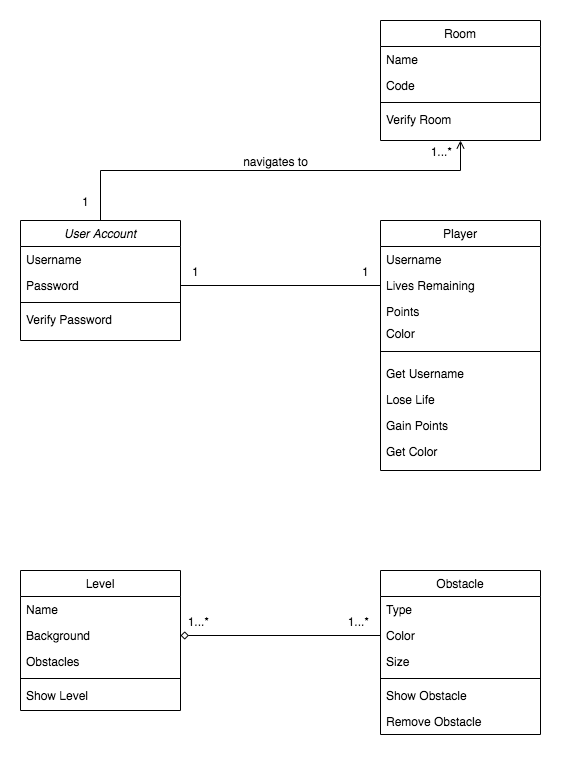
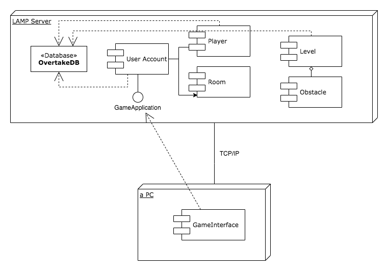

# CEN 4010 Principles of Software Engineering Spring 2021
# Milestone 1 Project Proposal: An online multiplayer 2-D game where players navigate through obstacles
# Team name and project name: Team 13
# Team 13
# Rosalba Monterrosas: rmonterrosas2015@fau.edu
# Brandon Basdeo: bbasdeo@fau.edu
# Ruth Betancourt: rbetancourt2003@fau.edu
# Michael Hollinger: mhollinger2020@fau.edu
# Lionel Munoz: lionelmunoz2018@fau.edu
# Luiz Zullino Junior: lzullinojuni2020@fau.edu
# 02/12/2020
# History Table
Version 0.00 - 2/12/21 - Added template

Version 0.01 - 2/15/21 - Added executive summary

Version 0.02 - 2/15/21 - Added competitive analysis

Version 0.03 - 2/16/21 - Added High-Level System Architecture, Team, Data Definition

Version 0.04 - 2/16/21 - Added Non-functional Requirements, Data Definition

Version 0.05 - 2/16/21 - Added Overview, scenarios and use cases

Version 0.06 - 2/16/21 - Added High-level Functional Requirements

Version 0.07 - 2/26/21 - Edited executive summary

Version 0.08 - 03/03/21 - Edited High-Level System Architecture

Version 0.09 - 03/05/21 - Edited High-level Functional Requirements and Data Definition

Version 0.10 - 04/05/21 - Added priorities to Functional Requirements, updated Data Definition, added UML class diagrams, added UML Component and Deployment Diagrams

Version 0.11 - 04/05/21 - Added Key Risks

## Executive Summary
Team 13 will be designing an original multiplayer game, with the goal of connecting people during times of social distancing. The game will be playable in a browser and users will be able to choose who they connect to. The system for allowing users to find each other will be a short randomized code, which can be shared using outside means like text or video communications. Players can maintain privacy by only sharing their code with people they choose. Only the usernames of players will be shared with other players, and all other information will be kept private. 

The main function of the game will be players competing against each other in a two dimensional obstacle course. Using user friendly interface, simple movement, and easy to understand controls, players will move from start to finish and compete to see who can finish first. The games will be short, a few minutes long, so people will not need to allocate a large amount of time to play. During times of social distancing, our game aims to provide a means of connecting with other people for a short moment of fun, before continuing with the rest of their day. 

## Competitive Analysis
Key Features: Competitor vs Team 13
|Competitor (Fall Guys)|	Team 13|
|---|---|
|Online Multiplayer	|Code Based Lobby|
|3D-Graphics|	2D-Graphics|
|Third Person|	Side-View|
|Winner Take all|	Point System|
|Customizable Avatars|	Customizable Avatars|

One of the major competitors that came to mind when coming up with our idea was the fame Fall Guys. When people think of online obstacle game, they think of Fall Guys. The first key difference will be how the multiplayer works. Fall Guys requires around a 50-person lobby which means there is no way to play solely with your friends. Our idea is to use a code invite system and have the games on a smaller scale so that games can take place between friends. Fall Guys takes place in a 3D environment, while our game will be in 2D. In this day and age, a games success has little to do with the dimensions of the game and more to do with how it makes use of the space. Only being in 2D will allow us to spend more time making the physics work well and give the user more control over their avatar. Our game will be using a side-view perspective which will allow the user to have precise control over the two dimensions they can move in. Fall Guys’ movement is much less focused on precision and more on situational awareness which allows are game to fill a difference niche. The point system between the two games will also be different. Fall Guys utilizes a winner take all when it comes to receiving rewards from playing. Our game will have a point system that will allow even those who come in second or third to earn rewards and have a sense of progression. Finally, you need a way to spend these points and this is where the two games will behave the same. The points players earn through their accomplishments will be used to buy customizable items to personalizer their avatars.

## Data Definition

**LAMP Server**: Linux Apache MySQL PHP [LAMP] server, provided by FAU, provides access to Linux (via SSH access) ), Apache (for web based development via PHP or CGI-BIN), MySQL (for database development), PHP (for web based development, and Tomcat (for java based web development).

**Unity**: American video game software development company used for the development of the game.

**OS**: The operational system

**Frame Rate**: The frequency of images (called frames) being displayed on the screen. Measured in frames per second (fps)

**Netcode**: The syncronization between the client and server side of the game.

**Bugs or Glitches**: Issues or problems that happen when the game do things that it was not supposed to do.

**Player**: User playing the game.

**Host**: User that starts a game and can share a code with other users so that these users can join the host's game.

**Code**: A string composed of 6 random letters and numbers that a user must enter to join a game.

**Main lobby**: A screen where a logged-in user can start or join a game.

**User Account**: Account information for a user.

## Overview, Scenarios and Use Cases

### Scenario One
     
   * David is a freshman at Florida Atlantic University. He would like to partake in a game that will help him meet new friends since all of his classes are online due to the pandemic. He meets someone named Paul through a Discussion post on Canvas. David invites Paul to play a game. He shares a procedurally-generated code with Paul, which allows him to join a session.
   
### Scenario Two
     
   * Sofia primarily uses a mobile device to access media. She is a fairly novice gamer and wants to use gaming to feel more connected with her online classmates. She installs the game and invites a few classmates to play.
   
### Scenario Three
     
   * Max has a new computer. He would like to utilize the computer to play a game, not necessarily as a benchmark, in order to "break it in" with some friends that he has not seen in a while due to the pandemic. He sends some of his friends an invite code and they join a session together.

### Use Case 1: User Login
1. The user opens the game.
2. The user enters their username.
3. The user enters their password.
4. The user clicks on the "Login" button.

### Use Case 2: User Signs Up for an Account
1. The user opens the game.
2. The user clicks on the "Sign Up" link.
3. The user enters their email.
4. The user enters a unique username.
5. The user enters a password.
6. The user confirms their password.
7. The user clicks on "Sign Up."

### Use Case 3: User Hosts a Game
1. The user logs in successfully.
2. The user clicks on the "Host Game" button.
3. The user enters the room name and shares the given code with their friends.
4. The user clicks on the "Create Room" button.

### Use Case 4: User Joins a Game
1. The user logs in successfully.
2. The user clicks on the "Join Game" button.
3. The user enters the code that was shared with them by the host.
4. The user clicks on the "Join Game" button.

### Use Case 5: User Plays a Game
1. The user successfully hosts or joins a game.
2. The user chooses the color of their character.
3. The user waits for other players to join the game.
4. The user votes for the level that they prefer.
5. The user begins playing the game when the host clicks on the "Play" button.
6. The user sees the ranking of each player's score at the end of the game.
7. The user can play the game again if the host clicks on the "Restart" button.
   

## High-level Functional Requirements

| Unique Identifier |                                                                                                                    Requirement                                                                                                                   | Priority |
|:-----------------:|:------------------------------------------------------------------------------------------------------------------------------------------------------------------------------------------------------------------------------------------------:|:--------:|
|        FR01       |                                                                                              A user should be able to register for a unique account.                                                                                             |     1    |
|        FR02       |                                                                                           A user should be able to login and arrive at the main lobby.                                                                                           |     1    |
|        FR03       |                                                                         A user should be able to join a host's game using a specific code that the host shared with them.                                                                        |     1    |
|        FR04       |                                                    A user should be able to become a host by starting a game and sharing a code with other users so that these users can join the host's game.                                                   |     1    |
|        FR05       |                                                                                       A user should not be able to start or join a game without logging in.                                                                                      |     1    |
|        FR06       |                                                                                A user should not be able to join a host's game without entering the correct code.                                                                                |     1    |
|        FR07       |                                                     A host should be able to wait for other users to join their game or start playing the game if at least one other player joined the game.                                                     |     2    |
|        FR08       |                                                                                           A user should be able to choose the color of their character.                                                                                          |     2    |
|        FR09       |                                                                                     A user should be able to move up, down, jump and duck to avoid obstacles.                                                                                    |     1    |
|        FR10       |                                                                          A user loses the game if they lose all 3 of their lives and can spectate the rest of the game.                                                                          |     2    |
|        FR11       |                                                                                      A user wins the game if they are the last player remaining in the game.                                                                                     |     1    |
|        FR12       |                                                                                                 A user gains points for each obstacle they avoid.                                                                                                |     1    |
|        FR13       |                                                                                      A user sees the ranking of the players' points at the end of the game.                                                                                      |     1    |
|        FR14       | A host should be able to choose whether to restart the game or not when the game ends. If the host restarts the game, the players do not have to re-enter the code again. If the host does not restart the game, users return to the main lobby. |     2    |
|        FR15       |                                                                                 A user should be able to quit the game at any time and return to the main lobby.                                                                                 |     2    |
|        FR16       |                                                                                    Other users that are not a host do not have the authority to start a game.                                                                                    |     2    |
|        FR17       |                                                                                           A user should be able to vote for the level that they prefer.                                                                                          |     3    |
|        FR18       |                                                                                                A user loses a life if they crash into an obstacle.                                                                                               |     1    |

  

## Non-functional Requirements
1. Graphics performance
   * The game needs to run with a frame rate of at least 30fps on average. The optimal frame rate range is between 30fps and 60fps.
1. Ease of use
   * The game and the game menu needs to be simple to use.
1. Response time
   * The game needs a near realtime response on average for the inputs of less than 30ms.
1. Client Resources
   * The game will run on a webpage so that it can be accessed by any OS.
   * The game needs to be lightweight with no more than 300MB of size.
   * The game needs to be able to run with a minimum of 1024MB of memory.
1. Server Resources
   * The server needs to run the OS Windows 10
   * The sever instance needs to have less than 1024MB of size.
   * The server instance needs to run with a minimum of 2048MB of memory.
1. Netcode
   * The response time between the client and server needs to be on average below 60ms.
1. Maintainability
   * The code for the game needs to be written in a way that it can be maintaned and updated in case of bugs/glitches are found or if the game needs to be expanded.

## High-Level System Architecture

### Database

Use MySQL database service on the Lamp server. The database will store the players’ login information (unique username and hashed password), game data, and their highest score.

### Server
Use our group’s LAMP server provided by the university.

### Client-Server Relationship

* Client-side: JavaScript
* Server-side: C#

### API’s

* Last.fm API: Allows the exploring of the entire collection of the website’s music data resources, such as artists and playlists.
https://english.api.rakuten.net/dimashirokov/api/LastFm

### Supported Browsers
* Google Chrome
* Firefox

### GUI

Unity for developing a 2-D game 
https://docs.unity3d.com/Manual/Unity2D.html

### Development

Unity for developing a 2-D game 
https://docs.unity3d.com/Manual/Unity2D.html

## Team

* Scrum Master: Rosalba Monterrosas
* Product Owner: Luiz Zullino Junior
* Development Team: Brandon Basdeo, Lionel Munoz, Michael Hollinger, Ruth Betancourt

## High-Level UML Diagrams
### UML Class Diagrams

  
### UML Component and Deployment Diagrams

## Key Risks
   The individuals in our team have provided a diverse skill set that has allowed as to avoid most skill or knowledge-based risks. One risk that has been plaguing our group from the beginning is scheduling. Our goal was to have daily, brief, scrum meetings to coordinate and keep track of progress.  Having all members of the group daily has been a struggle but we have been bolstering our communication through instant messaging and keeping detailed minutes of meetings to share with members who miss meetings. A risk that might affect us in the future has to do with the LAMP server. We plan to host our video game on the lamp server to allow multiplayer function. The strength of the lamp server is unknown to us and may cause issues and may limit the number of players who can play at once or limit the complexity of our game. The sooner we can begin beta testing on the server, the sooner we will understand our limitations, if there are any.
## Checklist

a)  Team decided on basic means of communications: DONE

b)  Team found a time slot to meet outside of the class: DONE

c)  Front and back end team leads chosen: DONE

d)  Github master chosen: DONE

e)  Team ready and able to use the chosen back and front-end frameworks: DONE

f)  Skills of each team member defined and known to all: DONE

g)  Team lead ensured that all team members read the final M1 and agree/understand it before submission: DONE
